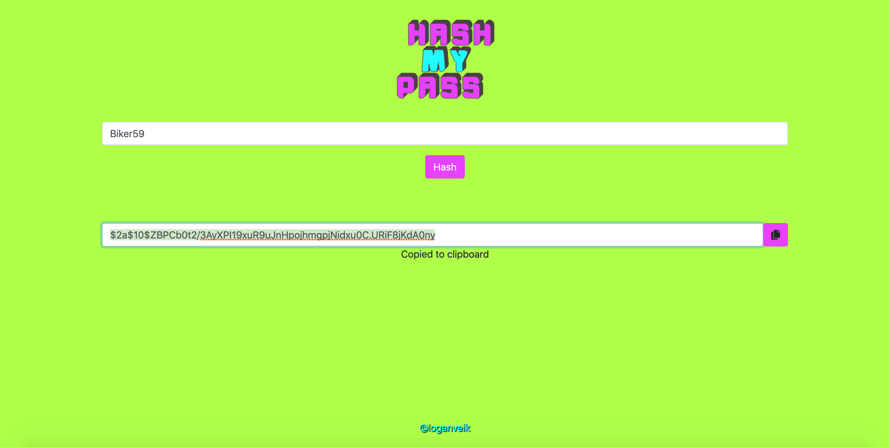

# Hash My Pass

### Links:
Demo - [https://hashmypass.herokuapp.com/](https://hashmypass.herokuapp.com/)
Repo - [https://github.com/loganveik/HashMyPass](https://github.com/loganveik/HashMyPass)

### Description:
Hash My Pass allows you to enter any password you want to keep secret or disguise and hashes it using Bcrypt and lets you copy the new hashed password to use anywhere.

### Technologies Used:
HTML5, Bootstrap4, CSS3, Javascript, jQuery, NodeJS, Express, Bcrypt, Gimp.

### How to Use:
1) Enter any password that you want hashed through Bcrypt then click the "Hash" button.

2) Your new hashed password will be displayed where you may also copy it so that you can paste it anywhere you'd like.

